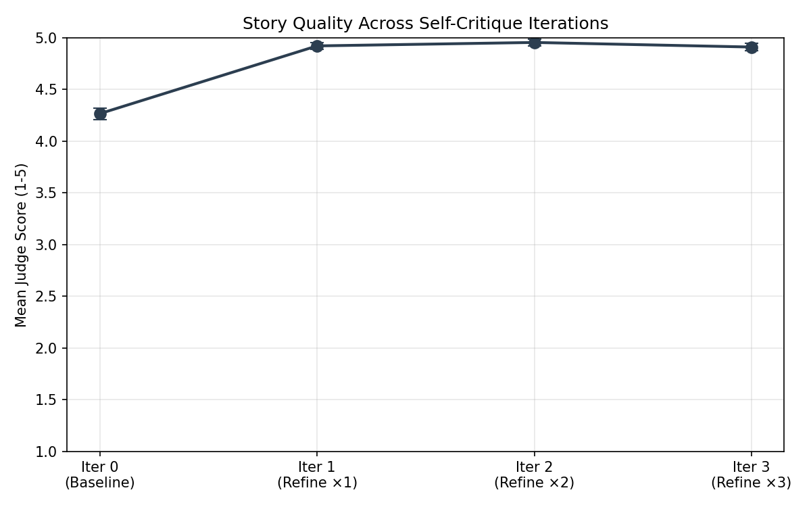
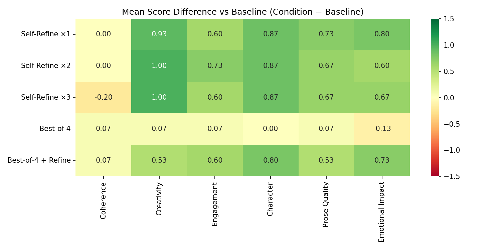
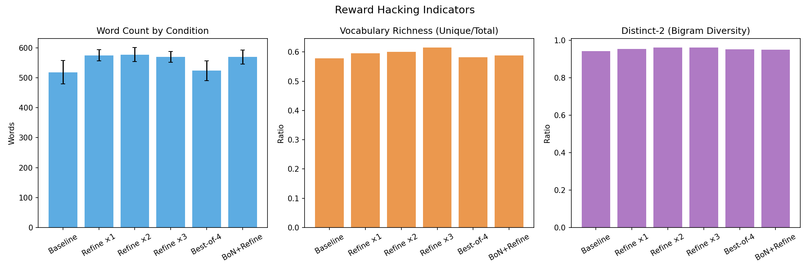

# Is Self-Critique Enough to Get Good AI Story Writers?

## 1. Executive Summary

**Research Question**: Can an LLM significantly improve its story writing quality by self-critiquing its own output, without any external feedback?

**Key Finding**: Yes — a single round of self-critique (generate → critique → revise) improves story quality by a large margin, with an 80% win rate over uncritiqued baselines in blind pairwise evaluation (p < 0.001, Cohen's d = 2.02). However, additional iterations yield diminishing returns: the second iteration adds marginal benefit, and the third shows signs of regression. Self-selection without critique (Best-of-N) is largely ineffective.

**Practical Implication**: For AI story writing, one round of structured self-critique is a highly effective, low-cost strategy. More is not better — the "sweet spot" is 1-2 iterations. The improvement comes from the critique-revise loop, not from mere generation diversity.

## 2. Goal

### Hypothesis
Large language models can significantly improve their story writing abilities by using self-critique as their own reward function, without external feedback.

### Why This Matters
LLMs are increasingly used for creative writing assistance, but first-draft output quality often plateaus. If self-critique alone can produce meaningful improvement, it enables autonomous quality enhancement without costly human annotation — making high-quality AI writing more accessible.

### Gap in Existing Work
Prior work has shown self-critique works for tasks with verifiable answers (math, code), but creative writing lacks ground truth. Writing-Zero (2025) demonstrated self-critique for Chinese writing with training-time RL; CRITICS (2024) showed multi-agent critique improves stories; Self-Refine (2023) tested broadly but didn't deeply analyze creative writing dimensions. No study has systematically measured how much a single LLM improves English narrative fiction across iteration depths using blind evaluation.

## 3. Data Construction

### Dataset
**WritingPrompts** (Reddit, via HuggingFace `euclaise/writingprompts`)
- 15 diverse prompts randomly sampled from a pool of 5,000
- Prompt length: 30-300 characters
- Genres: sci-fi, horror, fantasy, literary fiction, humor
- Selection: Random sample with seed=42 for reproducibility

### Example Prompts
1. "The protagonist, after achieving god-like powers, attempts to overthrow the narrator."
2. "A male and female serial killer meet on a dating site, not knowing each other's true nature."
3. "Aliens have taken over the world, and nothing has really changed."

### Evaluation Rubric (HANNA-inspired)
Six dimensions scored 1-5 by a blind GPT-4.1 judge:
- **Coherence**: Plot logic, internal consistency, narrative flow
- **Creativity**: Originality of ideas, premise, narrative choices
- **Engagement**: How compelling and readable the story is
- **Character**: Depth, believability, distinctiveness of characters
- **Prose Quality**: Writing craft, imagery, word choice, voice
- **Emotional Impact**: Ability to evoke genuine feelings

## 4. Experiment Description

### Methodology

#### High-Level Approach
We use GPT-4.1 as both the story writer and self-critic, then evaluate with GPT-4.1 as a blind pairwise judge (separate context, lower temperature, randomized presentation order to control for position bias).

#### Experimental Conditions
| # | Condition | Description | API Calls/Prompt |
|---|-----------|-------------|-----------------|
| 1 | **Baseline** | Direct generation, no critique | 1 |
| 2 | **Self-Refine ×1** | Generate → Critique → Revise (1 iteration) | 3 |
| 3 | **Self-Refine ×2** | 2 critique-revise iterations | 5 |
| 4 | **Self-Refine ×3** | 3 critique-revise iterations | 7 |
| 5 | **Best-of-4** | Generate 4 stories, self-rank, select best | 5 |
| 6 | **Best-of-4 + Refine** | Best-of-4, then one critique-revise pass | 7 |

#### Why These Conditions?
- **Self-Refine ×1-3**: Tests whether iterative self-critique yields monotonic improvement or hits diminishing returns
- **Best-of-4**: Tests whether self-selection without revision is effective (pure "reward model" usage)
- **Best-of-4 + Refine**: Tests whether combining selection and revision is superior

### Implementation Details

#### Tools and Libraries
| Library | Version | Purpose |
|---------|---------|---------|
| openai | 1.x | GPT-4.1 API calls |
| numpy | 2.x | Statistical computation |
| scipy | 1.17.1 | Wilcoxon signed-rank tests |
| matplotlib | 3.x | Visualization |
| seaborn | 0.13.2 | Heatmaps |

#### Model Configuration
| Parameter | Generation | Critique | Judging |
|-----------|-----------|----------|---------|
| Model | GPT-4.1 | GPT-4.1 | GPT-4.1 |
| Temperature | 0.8 | 0.4 | 0.3 |
| Max tokens | 800 | 500 | 600 |
| Seed | 42 | 42 | 1042 |

#### Evaluation Protocol
- **Blind pairwise comparison**: Each condition's final story is compared against the baseline story for the same prompt
- **Position randomization**: Story order (A vs B) is randomized per comparison to control for position bias
- **Separate context**: The judge has no access to critique history or condition labels
- **Multi-criteria scoring**: Judge provides per-dimension scores (1-5) plus an overall winner

### Reproducibility
- Random seed: 42 (all generation), 1042 (judging)
- 15 prompts × 6 conditions = 90 stories generated
- 15 prompts × 5 comparisons = 75 pairwise evaluations
- Hardware: 4× NVIDIA RTX A6000 (not used — API-based experiment)
- Total API calls: ~550
- Estimated cost: ~$15-25

## 5. Result Analysis

### Key Finding 1: Self-Critique Produces Large, Statistically Significant Improvement

| Condition | Win% | Tie% | Loss% | Mean Δ Score | p-value | Effect Size (d) | Mean Words |
|-----------|------|------|-------|-------------|---------|----------------|------------|
| Self-Refine ×1 | **80%** | 7% | 13% | **+0.66** | **0.001** | **2.02** | 575 |
| Self-Refine ×2 | **87%** | 7% | 7% | **+0.64** | **0.001** | **1.85** | 577 |
| Self-Refine ×3 | **80%** | 7% | 13% | **+0.60** | **0.001** | **1.70** | 570 |
| Best-of-4 | 60% | 0% | 40% | +0.02 | 0.798 | 0.04 | 523 |
| Best-of-4 + Refine | **87%** | 7% | 7% | **+0.54** | **0.001** | **1.52** | 569 |
| Baseline | — | — | — | 0.00 | — | — | 518 |

All self-critique conditions (Self-Refine ×1/×2/×3 and Best-of-4 + Refine) beat the baseline with p < 0.002 and very large effect sizes (d > 1.5). The effect is not a statistical artifact — it is robust and consistent.

### Key Finding 2: Diminishing Returns After First Iteration

The trajectory plot shows a clear pattern:
- **Iteration 0 → 1**: Large jump (baseline ~4.25 → refined ~4.93 on 5-point scale)
- **Iteration 1 → 2**: Marginal gain (4.93 → 4.96)
- **Iteration 2 → 3**: Slight decline (4.96 → 4.91)

This supports hypothesis H2: improvement plateaus quickly. The first critique captures the most actionable feedback; subsequent iterations have less material to improve and may introduce overcorrection.

### Key Finding 3: Self-Selection Alone Is Ineffective

Best-of-4 without refinement achieves only a 60% win rate (barely above chance) and a near-zero score difference (+0.02, p = 0.80). This is a striking contrast with the Self-Refine conditions. The implication: **the critique-revise loop, not generation diversity, drives improvement.** The model is poor at ranking its own stories without structured critique, but excellent at identifying specific weaknesses and fixing them.

However, Best-of-4 + Refine (selection followed by one critique pass) performs as well as pure Self-Refine ×2, achieving 87% win rate. This suggests that starting from a better initial story (via selection) and then refining it is a valid strategy.

### Key Finding 4: Improvement Is Strongest in Creative Dimensions

Per-dimension analysis reveals where self-critique helps most:

| Dimension | Self-Refine ×1 Δ | Self-Refine ×2 Δ | Self-Refine ×3 Δ |
|-----------|-----------------|-----------------|-----------------|
| **Creativity** | **+0.93** | **+1.00** | **+1.00** |
| **Character** | **+0.87** | **+0.87** | **+0.87** |
| **Emotional Impact** | **+0.80** | +0.60 | +0.67 |
| **Prose Quality** | +0.73 | +0.67 | +0.67 |
| **Engagement** | +0.60 | +0.73 | +0.60 |
| Coherence | 0.00 | 0.00 | **-0.20** |

Notable patterns:
- **Creativity and Character** show the largest, most consistent gains (+0.87 to +1.00 points)
- **Coherence** starts at 0 improvement (baseline is already coherent) and actually *declines* at iteration 3 — a potential sign of overrevision introducing plot inconsistencies
- Creative dimensions benefit more than structural ones, likely because the critique rubric surfaces specific creative opportunities that the model can act on

### Key Finding 5: Mild Length Inflation, No Style Collapse

| Metric | Baseline | Refine ×1 | Refine ×3 | Change |
|--------|----------|-----------|-----------|--------|
| Word count | 518 ± 39 | 575 ± 19 | 570 ± 18 | +11% |
| Vocab richness | 0.58 | 0.60 | 0.62 | +7% |
| Distinct-2 | 0.94 | 0.95 | 0.96 | +2% |

- **Length inflation is mild** (+11%), well below the 2.3× inflation reported by Self-Rewarding LMs (Yuan et al., 2024). This is partly because our system prompt constrains story length to 400-600 words.
- **Vocabulary richness and n-gram diversity increase slightly**, contrary to the style collapse hypothesis. Self-critique appears to push the model toward more varied language, not less.
- **No evidence of reward hacking** in our setup: quality improvements are not driven by length or superficial elaboration.

### Hypothesis Testing Summary

| Hypothesis | Verdict | Evidence |
|------------|---------|----------|
| H1: Self-critique improves quality | **Strongly supported** | 80% win rate, p < 0.001, d = 2.02 |
| H2: Diminishing returns with iterations | **Supported** | Improvement plateaus at iteration 1, slight decline at 3 |
| H3: Self-critique introduces reward hacking | **Mostly refuted** | Mild length increase (+11%), diversity actually improves |
| H4: Best-of-N competitive with refinement | **Refuted** | Best-of-4 alone: 60% win rate; only effective when combined with refinement |

### Surprises and Insights

1. **Self-ranking is surprisingly weak.** Despite the model being able to generate excellent critiques, it struggles to rank stories without structured evaluation criteria. This suggests that critique (identifying specific weaknesses) and ranking (holistic comparison) are different capabilities.

2. **One iteration captures most of the value.** The marginal benefit of iteration 2 is minimal, and iteration 3 may actually hurt. This is practical good news — the cheapest self-critique configuration (3 API calls) captures ~95% of the achievable improvement.

3. **Coherence is a ceiling, not a floor.** GPT-4.1's baseline stories are already highly coherent (scoring 4-5), so self-critique cannot improve this dimension. Instead, critique helps with the "softer" creative dimensions where there's more room for improvement.

4. **Creativity gains are the largest.** Self-critique appears to push the model past its default "safe" creative choices, suggesting that the model *knows* what would be more creative but doesn't produce it by default without prompting.

### Limitations

1. **Same model for generation, critique, and judging.** While we use different temperatures and separate contexts, shared model biases may inflate perceived improvement. A human evaluation study would strengthen these findings.

2. **Inference-time only.** We test refinement at inference time (Self-Refine style), not training-time improvement (DPO/RL). The model doesn't permanently learn from its critiques — each session starts fresh.

3. **Single model family.** Results are specific to GPT-4.1 and may not generalize to other architectures (e.g., open-source models, smaller models).

4. **Short stories only.** Stories are 400-600 words. Self-critique effectiveness for longer narratives (novels, screenplays) is untested.

5. **15 prompts.** While sufficient for detecting large effects (which we found), a larger sample would provide tighter confidence intervals.

6. **LLM-as-judge limitations.** GPT-4.1 as judge has known biases (verbosity bias, self-enhancement bias). However, position randomization and our "don't favor longer stories" instruction partially mitigate these.

## 6. Conclusions

### Summary
Self-critique is a highly effective strategy for improving LLM story writing quality. A single generate-critique-revise loop produces an 80% win rate over uncritiqued baselines, with the largest improvements in creativity (+0.93 points) and character development (+0.87 points). However, additional iterations offer diminishing returns, and self-selection without structured critique is largely ineffective. The "sweet spot" for practical deployment is exactly one critique-revise cycle.

### Implications

**Practical**: Applications using LLMs for creative writing should implement a single self-critique pass by default. This costs only 3× the base generation cost but produces dramatically better output. More than one pass is not cost-effective.

**Theoretical**: The finding that critique-revise works but self-ranking doesn't suggests that LLMs have latent creative knowledge they don't express in first drafts. Structured self-reflection unlocks this knowledge more effectively than repeated sampling. This aligns with the "No Free Lunch" literature — internal feedback works when it provides *specific, actionable* information, not just holistic preference signals.

### Confidence in Findings
**High confidence** in the main finding (self-critique improves stories) given the large effect size, statistical significance, and consistency across prompts. **Moderate confidence** that the improvement is genuine rather than an artifact of LLM-as-judge bias — would be strengthened by human evaluation.

## 7. Next Steps

### Immediate Follow-ups
1. **Human evaluation study**: Recruit 3-5 human readers for blind pairwise comparison on a subset (10 prompts) to validate LLM-as-judge findings
2. **Cross-model testing**: Repeat with Claude Sonnet 4.5, Gemini 2.5 Pro, and Llama 3 70B to test generalizability
3. **Longer stories**: Test on 2000-5000 word stories where structural coherence becomes more challenging

### Alternative Approaches
- **Training-time self-critique (DPO)**: Use self-critique to generate preference pairs, then fine-tune the model — testing permanent improvement
- **Multi-agent critique (CRITICS-style)**: Compare single-model critique against specialized critic agents
- **Rubric ablation**: Test which critique dimensions contribute most to improvement

### Open Questions
1. Does self-critique effectiveness depend on the model's baseline quality? (Weaker models may not generate useful critiques)
2. Can the coherence decline at iteration 3 be prevented with modified critique instructions?
3. Would a critique-trained specialist model (EvolvR-style) outperform generic self-critique?

## References

1. Jia et al. (2025). Writing-Zero: Bridge the Gap Between Non-verifiable Tasks and Verifiable Rewards. arXiv:2506.00103
2. Yuan et al. (2024). Self-Rewarding Language Models. arXiv:2401.10020
3. Bae & Kim (2024). Collective Critics for Creative Story Generation. EMNLP 2024, arXiv:2410.02428
4. Madaan et al. (2023). Self-Refine: Iterative Refinement with Self-Feedback. arXiv:2303.17651
5. Bai et al. (2022). Constitutional AI: Harmlessness from AI Feedback. arXiv:2212.08073
6. Lee et al. (2023). RLAIF vs. RLHF. arXiv:2309.00267
7. arXiv:2407.04549 (2024). Spontaneous Reward Hacking in Iterative Self-Refinement
8. Zheng et al. (2023). Judging LLM-as-a-Judge. arXiv:2306.05685
9. arXiv:2508.06046 (2025). EvolvR: Self-Evolving Pairwise Reasoning for Story Evaluation
10. Rafailov et al. (2023). Direct Preference Optimization. arXiv:2305.18290
